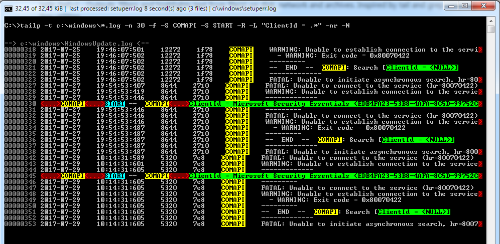

# tailp

tailp (tail+) - Outputs, filters and highlights text from file(s) on disk, network and archives.
Inspired by tail and grep command line utilities.

See the [help.txt](tailp/Resources/help.txt) file for details.

## Example

`tailp -t c:\windows\*.log -n 30 -f -S COMAPI -S START -R -L "ClientId = .*" -nr -N`

## Prerequisites

.NET 4.5.2

## License

This project is licensed under the MIT License - see the [LICENSE](LICENSE) file for details.
